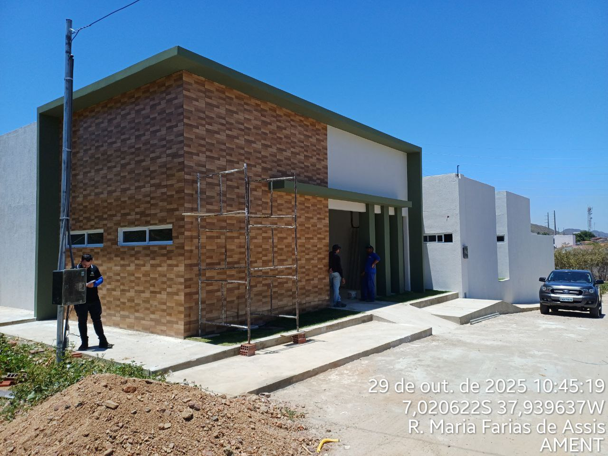

# REGISTRO FOTOGRÁFICO - FISCALIZAÇÃO DE OBRAS

| IMAGEM | CÓDIGO | OBRA | NÚMERO | MODALIDADE | ÚLTIMA ATUALIZAÇÃO | SITUAÇÃO |
|---|---|---|---|---|---|---|
|  | [RF0001](https://github.com/NoScandalize/prefeitura-img/blob/main/rf0001-ament/README.md) | AMENT | 00004/2024 | Concorrência (Lei Nº 14.133/2021) | 29/10/2025 | 🟡 Em execução |
|  | [RF0002](https://github.com/NoScandalize/prefeitura-img/blob/main/rf0002-creche-dnocs/README.md) | CRECHE DNOCS | 40001/2023	| Tomada de Preços (Lei Nº 8.666/1993) | 10/09/2025 | 🔴 Paralisada |
|  | [RF0003](https://github.com/NoScandalize/prefeitura-img/blob/main/rf0003-escola-polo-dnocs/README.md) | ESCOLA POLO DNOCS | 	10005/2025 | Dispensa (Lei Nº 14.133/2021) | 08/09/2025 | 🟢 Concluída |
|  | [RF0004](https://github.com/NoScandalize/prefeitura-img/blob/main/rf0004-calcamento-nova-coremas/README.md) | CALÇAMENTO NOVA COREMAS | 00013/2022   00008/2022   00001/2022 | Tomada de Preços (Lei Nº 8.666/1993) | 23/10/2025 | 🟡 Em execução |
|  | [RF0005](https://github.com/NoScandalize/prefeitura-img/blob/main/rf0005-calcamento-mae-dagua/README.md) | CALÇAMENTO MÃE D'ÁGUA | 00001/2022 | Tomada de Preços (Lei Nº 8.666/1993) | 12/06/2025 | 🟢 Concluída |
|  | [RF0006](https://github.com/NoScandalize/prefeitura-img/blob/main/rf0006-calcamento-currais-dnocs-lucrenato/README.md) | CALÇAMENTO - CURRAIS, DNOCS E LUCRENATO | 40014/2023 | Tomada de Preços (Lei Nº 8.666/1993) | 16/04/2025 | ⚠️ Abandonada - Parcialmente Concluída |
|  | [RF0007](https://github.com/NoScandalize/prefeitura-img/blob/main/rf0007-creche-nova-coremas/README.md) | CRECHE NOVA COREMAS | 40014/2023 | Tomada de Preços (Lei Nº 8.666/1993) | 16/04/2025 | 🔴 Paralisada |
|  | [RF0008](https://github.com/NoScandalize/prefeitura-img/blob/main/rf0008-pavimento-parede-acude/README.md) | PAVIMENTO PAREDE DO AÇUDE | 00008/2021 | Tomada de Preços (Lei Nº 8.666/1993) | 06/03/2023 | 🟢 Concluída |